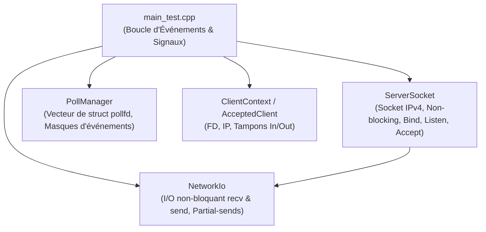
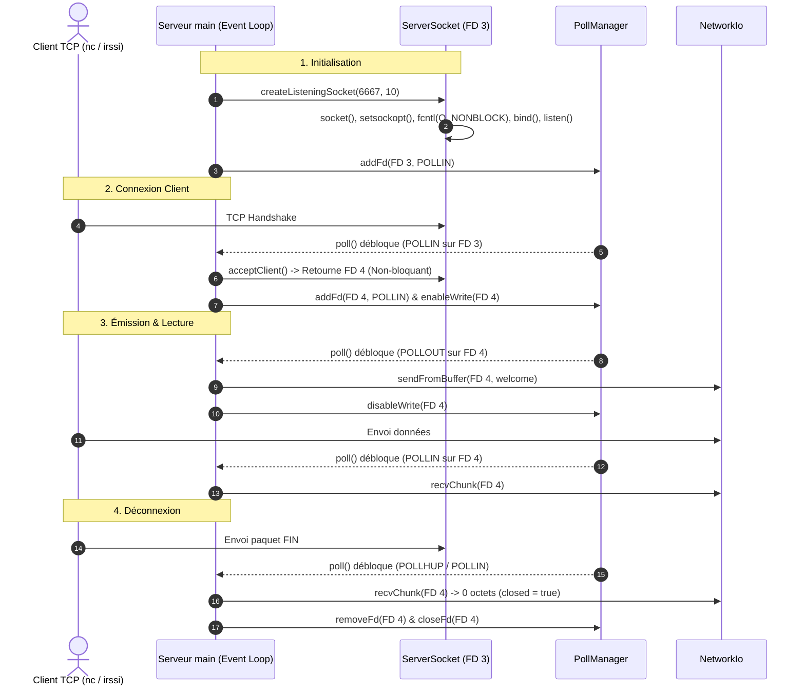

# 📡 FT_IRC - Network Layer (C++98)


-green.svg)


---

## 📌 Présentation

Ce dépôt contient la **couche réseau non-bloquante** pour le projet **`ft_irc`** (École 42). 

Elle met en œuvre un modèle d'**Entrées/Sorties Multiplexées (I/O Multiplexing)** basé sur l'appel système POSIX `poll()`. Cette architecture permet au serveur IRC de gérer simultanément plusieurs connexions clientes au sein d'un unique fil d'exécution (**single-threaded event loop**), sans jamais bloquer le thread principal et sans consommation inutile de ressources processeur.

---

## 🏛️ Architecture & Structure des Classes

Le module repose sur trois composants orientés objet (respectant la norme C++98 et les principes RAII) :



### 🧩 Composants du Projet

| Classe / Module | Fichiers Source | Description & Rôle Technique |
| :--- | :--- | :--- |
| **`ServerSocket`** | [`ServerSocket.hpp`](file:///Users/ayoubbareich/Desktop/ft_irc_git/ayoub_code/ServerSocket.hpp)<br/>[`ServerSocket.cpp`](file:///Users/ayoubbareich/Desktop/ft_irc_git/ayoub_code/ServerSocket.cpp) | Encapsule la création du socket TCP IPv4, la configuration de l'option `SO_REUSEADDR`, l'activation du mode non-bloquant (`O_NONBLOCK` via `fcntl`), l'association au port (`bind`), l'écoute (`listen`) et l'acceptation des clients (`accept`). |
| **`PollManager`** | [`PollManager.hpp`](file:///Users/ayoubbareich/Desktop/ft_irc_git/ayoub_code/PollManager.hpp)<br/>[`PollManager.cpp`](file:///Users/ayoubbareich/Desktop/ft_irc_git/ayoub_code/PollManager.cpp) | Gère la collection dynamique `std::vector<struct pollfd>`. Offre des méthodes d'activation/désactivation dynamique des masques d'événements (`POLLIN`, `POLLOUT`) et encapsule l'attente synchrone via `poll()`. |
| **`NetworkIo`** | [`NetworkIo.hpp`](file:///Users/ayoubbareich/Desktop/ft_irc_git/ayoub_code/NetworkIo.hpp)<br/>[`NetworkIo.cpp`](file:///Users/ayoubbareich/Desktop/ft_irc_git/ayoub_code/NetworkIo.cpp) | Classe statique utilitaire offrant les fonctions de lecture (`recvChunk`) et d'écriture (`sendFromBuffer`). Intercepte les interruptions réseau (`EAGAIN` / `EWOULDBLOCK`) et conserve le reliquat des données lors des envois partiels. |
| **`main_test`** | [`main_test.cpp`](file:///Users/ayoubbareich/Desktop/ft_irc_git/ayoub_code/main_test.cpp) | Point d'entrée de l'application de test : interception des signaux POSIX (`SIGINT`, `SIGTERM`), exécution de la boucle événementielle et gestion du cycle de vie des clients. |

---

## ⚡ Caractéristiques Techniques

- **Sockets Non-Bloquants (`O_NONBLOCK`)** : Tous les descripteurs de fichiers (socket d'écoute et sockets clients) sont configurés en mode non-bloquant avec `fcntl()`.
- **Réutilisation de Port (`SO_REUSEADDR`)** : Permet de relancer le serveur immédiatement sans être bloqué par le délai `TIME_WAIT` du noyau TCP.
- **Gestion Dynamique de `POLLOUT`** : Le drapeau d'écriture `POLLOUT` n'est activé que lorsque le buffer de sortie d'un client contient des données à envoyer.
- **Gestion des Envois Partiels (Partial Sends)** : Si l'appel système `send()` ne transmet qu'une partie des données, le reliquat est conservé dans le buffer applicatif pour le tour de poll suivant.
- **Fermeture Propre (Graceful Shutdown)** : Interception des signaux `SIGINT` (Ctrl+C) et `SIGTERM` pour libérer tous les sockets et ressources système proprement.

---

## 🛠️ Compilation & Utilisation

### Compilation

Utilisez le `Makefile` inclus (compatible avec les flags `-Wall -Wextra -Werror -std=c++98`) :

```bash
# Compilation du projet
make

# Nettoyage des fichiers objets (.o)
make clean

# Recompilation complète
make re
```

L'exécutable généré est nommé **`irc_server_test`**.

### Lancement du Serveur

```bash
# Lancement sur le port 6667 par défaut
./irc_server_test

# Lancement sur un port spécifique (ex: 8080)
./irc_server_test 8080
```

---

## 🧪 Connexion Client & Test

### Connexion via Netcat (`nc`)

Dans un second terminal :

```bash
nc 127.0.0.1 6667
```

**Résultat :**
1. Le client reçoit la réponse d'accueil IRC (`:server 001 Client :Bienvenue...`).
2. Le terminal du serveur affiche :
   ```text
   [+ CONNECT] Nouveau client connecté | FD: 4 | IP: 127.0.0.1
   ```
3. Envoyez un texte (ex: `NICK user\r\n`) $\rightarrow$ Le serveur le lit et renvoie un écho sans bloquer.

### Connexion via Client IRC (`irssi`)

```bash
irssi -c 127.0.0.1 -p 6667
```

---

## 🔁 Séquence d'Événements (Sequence Diagram)



---

## 📄 Documentation Interne

- 📘 **[`TESTING_GUIDE.md`](file:///Users/ayoubbareich/Desktop/ft_irc_git/ayoub_code/TESTING_GUIDE.md)** : Guide étape par étape pour valider les 6 scénarios de tests réseau.
- 📘 **[`WHAT_I_DID.md`](file:///Users/ayoubbareich/Desktop/ft_irc_git/ayoub_code/WHAT_I_DID.md)** : Synthèse des fonctionnalités et guide d'intégration.
