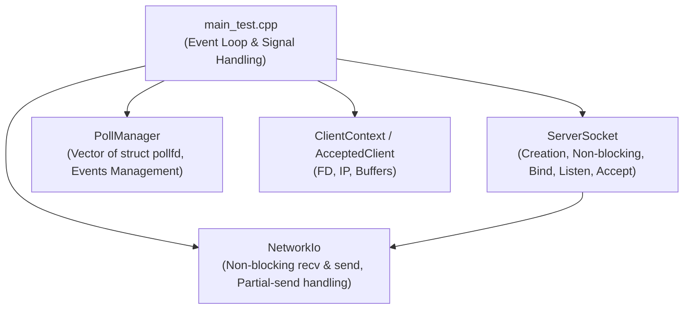
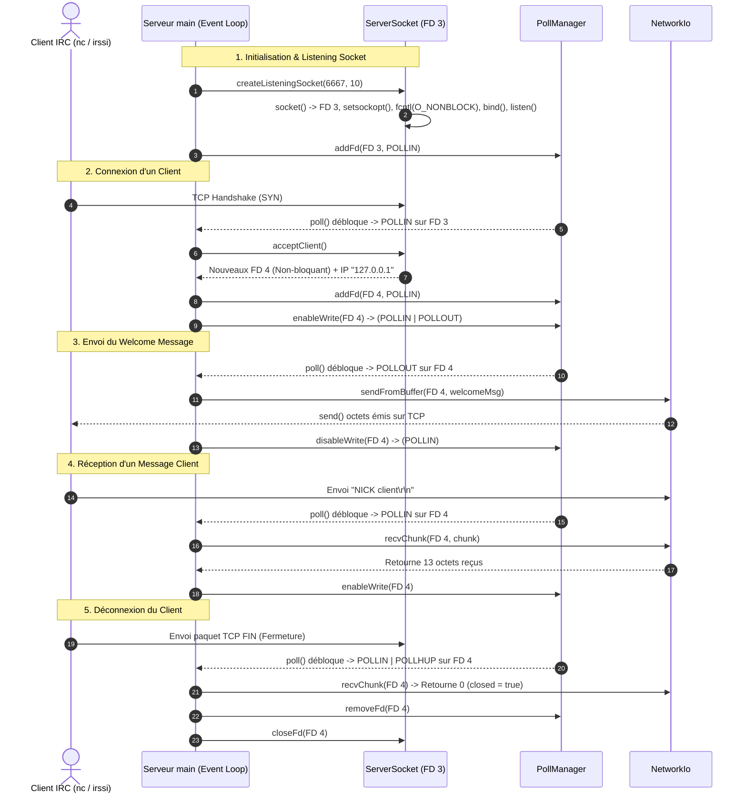

# 🚀 SIMULATION D'EXÉCUTION ET DOCUMENTATION DÉTAILLÉE DU MODULE RÉSEAU (`FT_IRC`)

> **Composant :** Couche Réseau Non-Bloquante (C++98 / I/O Multiplexing via `poll`)  
> **Langue :** Français  

---

## 📌 1. Vue d'Ensemble & Architecture Globale

Le module réseau constitue la couche fondamentale de communication du serveur IRC **`ft_irc`**. Il met en œuvre un modèle de **Multiplexage d'Entrées/Sorties (I/O Multiplexing)** basé sur l'appel système POSIX `poll()`. 

Grâce à ce modèle **non-bloquant** et **monothread (single-threaded event loop)**, le serveur peut gérer des dizaines de connexions clientes simultanées sans bloquer le fil d'exécution et sans consommer inutilement du temps processeur.

### 🏛️ Diagramme des Composants C++



### 🧩 Responsabilités des Modules

| Module C++ | Fichiers | Responsabilités Principales |
| :--- | :--- | :--- |
| **`ServerSocket`** | `ServerSocket.hpp`<br/>`ServerSocket.cpp` | Encapsule la création de sockets IPv4 TCP, la configuration `SO_REUSEADDR`, le mode non-bloquant `O_NONBLOCK`, l'association de port (`bind`), l'écoute (`listen`) et l'acceptation des clients (`accept`). |
| **`PollManager`** | `PollManager.hpp`<br/>`PollManager.cpp` | Encapsule la collection dynamique `std::vector<struct pollfd>`. Gère l'ajout/retrait de descripteurs de fichiers (FDs), le réglage des masques d'événements (`POLLIN`, `POLLOUT`), et l'appel à `poll()`. |
| **`NetworkIo`** | `NetworkIo.hpp`<br/>`NetworkIo.cpp` | Classe statique utilitaire gérant la lecture non-bloquante (`recvChunk`) et l'écriture non-bloquante (`sendFromBuffer`) avec support des envois partiels et détection des interruptions `EAGAIN` / `EWOULDBLOCK`. |
| **`main_test`** | `main_test.cpp` | Orchestrateur principal : instancie les modules, capture les signaux de fermeture (`SIGINT`, `SIGTERM`), et exécute la boucle d'événements principale. |

---

## ⏱️ 2. Simulation d'Exécution Détaillée Étape par Étape

Voici le scénario complet d'exécution du serveur, illustré étape par étape avec le suivi de l'état des sockets, des tampons et des variables système.



---

### 🔍 Détail du Deroulement d'Exécution

#### Étape 2.1 : Démarrage du Serveur & Enregistrement des Signaux
1. Lancement de la commande : `./irc_server_test 6667`
2. Exécution du `main()` :
   - Analyse de `argv[1]` $\rightarrow$ `port = 6667`.
   - Attachement des gestionnaires de signaux POSIX :
     ```cpp
     std::signal(SIGINT, handleSignal);   // Ctrl+C
     std::signal(SIGTERM, handleSignal);  // Signal d'arrêt système
     ```
3. Instanciation des objets principaux :
   - `serverSocket` : `_fd = -1`, `_port = 0`.
   - `poller` : vecteur `_fds` vide.
   - `clients` : `std::map<int, ClientContext>` vide.

#### Étape 2.2 : Configuration du Listening Socket (FD 3)
Appel à `serverSocket.createListeningSocket(6667, 10)` :
- **`_createSocket()`** : Appel système `socket(AF_INET, SOCK_STREAM, 0)` $\rightarrow$ allocation du **`FD 3`**.
- **`_configureReuseAddr()`** : Appel système `setsockopt(3, SOL_SOCKET, SO_REUSEADDR, &1, sizeof(int))`.
- **`setNonBlocking(3)`** : Appel système `fcntl(3, F_SETFL, O_NONBLOCK)` $\rightarrow$ le socket serveur est non-bloquant.
- **`_bindSocket()`** : Appel système `bind(3, 0.0.0.0:6667)`.
- **`_startListening(10)`** : Appel système `listen(3, 10)` $\rightarrow$ le socket passe en mode passif.
- **Ajout au Poller** : `poller.addFd(3, POLLIN)` $\rightarrow$ `_fds` contient `[{fd: 3, events: POLLIN, revents: 0}]`.

> [!TIP]
> **Pourquoi le mode non-bloquant sur le socket d'écoute ?**  
> Si une connexion est annulée par le client (TCP RST) juste avant l'appel à `accept()`, un socket d'écoute bloquant pourrait figer le serveur indéfiniment. En mode non-bloquant, `accept()` retourne immédiatement avec `EAGAIN`.

#### Étape 2.3 : Boucle d'Événements (`while (g_running)`)
Le serveur entre dans la boucle principale.
- `poller.wait(1000)` effectue l'appel système `poll(&_fds[0], 1, 1000)`.
- **Cas 1 : Timeout** $\rightarrow$ Si aucun client ne se connecte dans les 1000 ms, `poll()` renvoie `0`. La boucle fait `continue`.

#### Étape 2.4 : Connexion d'un Client (Exemple Client 1 $\rightarrow$ FD 4)
1. Le client lance `nc 127.0.0.1 6667`.
2. `poll()` débloque et renvoie `1` avec `revents = POLLIN` sur le `FD 3`.
3. Le serveur exécute `serverSocket.acceptClient(newClient)` :
   - Appel système `accept(3, &clientAddr, &clientLen)` $\rightarrow$ le noyau alloue le **`FD 4`**.
   - `setNonBlocking(4)` $\rightarrow$ le socket du client 4 est immédiatement marqué non-bloquant.
   - Conversion IP : `inet_ntoa()` $\rightarrow$ `"127.0.0.1"`.
4. Mise à jour de l'état du serveur :
   - `poller.addFd(4, POLLIN)`.
   - Création du `ClientContext` associant l'IP et les tampons au `FD 4`.
   - Préparation du message de bienvenue dans `outBuffer` :
     ```cpp
     clients[4].outBuffer += ":server 001 Client :Bienvenue sur le serveur IRC...\r\n";
     ```
   - Activation de la surveillance d'écriture : `poller.enableWrite(4)` $\rightarrow$ le masque du FD 4 devient `POLLIN | POLLOUT`.

#### Étape 2.5 : Traitement de l'Événement `POLLOUT` (Envoi des Données)
1. À l'itération suivante de `poll()`, le `FD 4` est prêt en écriture $\rightarrow$ `revents & POLLOUT` est VRAI.
2. Appel à `NetworkIo::sendFromBuffer(4, client.outBuffer, wouldBlock)` :
   - Appel système `send(4, outBuffer.c_str(), outBuffer.size(), 0)`.
   - Supposons que les 67 octets soient émis d'un coup $\rightarrow$ `send()` retourne `67`.
   - `outBuffer.erase(0, 67)` $\rightarrow$ le tampon devient vide.
3. Désactivation de `POLLOUT` :
   - `poller.disableWrite(4)` $\rightarrow$ le masque du FD 4 repasse à `POLLIN`.

> [!IMPORTANT]
> **Gestion des Envois Partiels (Partial Sends) :**  
> Si `send()` n'envoie que 30 octets sur les 67 (par exemple si le tampon système réseau est presque plein), `sendFromBuffer()` n'efface que 30 octets. Le reste (37 octets) demeure dans `outBuffer` et `POLLOUT` reste activé pour envoyer le reliquat au prochain tour de poll.

#### Étape 2.6 : Traitement de l'Événement `POLLIN` (Réception de Données)
1. Le client envoie `"NICK client\r\n"`.
2. `poll()` signale `POLLIN` sur le `FD 4`.
3. Appel à `NetworkIo::recvChunk(4, chunk, closed, wouldBlock)` :
   - Appel système `recv(4, buffer, 4096, 0)`.
   - Le noyau remplit le tampon local avec 13 octets et retourne `13`.
   - `chunk` contient `"NICK client\r\n"`.
4. Traitement applicatif :
   - Le serveur enregistre la donnée reçue et prépare un message d'écho dans `outBuffer`.
   - `poller.enableWrite(4)` réactive `POLLOUT`.

#### Étape 2.7 : Déconnexion Propre du Client (FIN TCP / `recv() == 0`)
1. Le client ferme son terminal ou quitte l'application.
2. Le système d'exploitation distant émet un paquet TCP `FIN`.
3. `poll()` détecte l'événement et alimente `revents` avec `POLLIN | POLLHUP`.
4. Appel à `NetworkIo::recvChunk(4, chunk, closed, wouldBlock)` :
   - `recv()` retourne `0`.
   - Le code positionne `closed = true`.
5. Procédure de nettoyage :
   - `poller.removeFd(4)` $\rightarrow$ retrait de la surveillance `poll`.
   - `ServerSocket::closeFd(4)` $\rightarrow$ appel système `close(4)` pour restituer le FD au noyau.
   - `clients.erase(4)` $\rightarrow$ suppression de l'entrée dans la map.

#### Étape 2.8 : Interruption par Signal (`Ctrl+C`) & Nettoyage Final
1. L'utilisateur appuie sur `Ctrl+C` $\rightarrow$ Réception du signal `SIGINT`.
2. `handleSignal(int sig)` passe la variable `g_running = false`.
3. La boucle `while (g_running)` s'arrête.
4. Nettoyage final :
   - Fermeture et retrait de tous les sockets clients encore actifs dans `clients`.
   - Appel à `serverSocket.closeSocket()` $\rightarrow$ `close(3)` ferme le socket d'écoute.
   - Sortie du programme avec le code `0`.

---

## 🛠️ 3. Guide Référence des Appels Système POSIX (System Calls)

Voici l'analyse exhaustive de chaque appel système C POSIX implémenté dans le code.

```
+-----------------------------------------------------------------------------------+
|                        RÉSUMÉ DES APPELS SYSTÈME UTILISÉS                         |
+---------------+----------------------------------+--------------------------------+
| Appel Système | Rôle Principal                   | Fichier d'Appel                |
+---------------+----------------------------------+--------------------------------+
| socket()      | Allocation de la socket IPv4 TCP | ServerSocket.cpp               |
| setsockopt()  | Configuration SO_REUSEADDR       | ServerSocket.cpp               |
| fcntl()       | Activation du mode O_NONBLOCK    | ServerSocket.cpp               |
| bind()        | Liaison Adresse IP & Port        | ServerSocket.cpp               |
| listen()      | Passage en socket passif écoute  | ServerSocket.cpp               |
| accept()      | Extraction des connexions clients| ServerSocket.cpp               |
| poll()        | Multiplexage synchrone d'E/S     | PollManager.cpp                |
| recv()        | Lecture des octets TCP           | NetworkIo.cpp                  |
| send()        | Émission des octets TCP          | NetworkIo.cpp                  |
| close()       | Fermeture de descripteur (FD)    | ServerSocket.cpp               |
| signal()      | Interception SIGINT / SIGTERM    | main_test.cpp                  |
+---------------+----------------------------------+--------------------------------+
```

---

### 1. `socket()`
```c
int socket(int domain, int type, int protocol);
```
- **Fichier :** `ServerSocket.cpp` $\rightarrow$ `_createSocket()`
- **Appel :** `_fd = socket(AF_INET, SOCK_STREAM, 0);`
- **Rôle :** Alloue un point de communication réseau et retourne un descripteur de fichier (FD).
- **Paramètres :**
  - `domain = AF_INET` : IPv4.
  - `type = SOCK_STREAM` : Protocole orienté connexion (TCP).
  - `protocol = 0` : Choix automatique du protocole TCP par défaut.
- **Retour :** Entier positif (FD) en cas de succès, `-1` en cas d'erreur avec définition de `errno`.

---

### 2. `setsockopt()`
```c
int setsockopt(int sockfd, int level, int optname, const void *optval, socklen_t optlen);
```
- **Fichier :** `ServerSocket.cpp` $\rightarrow$ `_configureReuseAddr()`
- **Appel :** `setsockopt(_fd, SOL_SOCKET, SO_REUSEADDR, &optval, sizeof(optval));`
- **Rôle :** Configure les options associées au socket.
- **Paramètres :**
  - `sockfd` : Le descripteur du socket (`_fd`).
  - `level = SOL_SOCKET` : Option au niveau du socket lui-même.
  - `optname = SO_REUSEADDR` : Permet la réutilisation immédiate du port local (évite l'erreur `Address already in use` causée par l'état `TIME_WAIT` TCP).
  - `optval` : Pointeur vers l'entier `1` (Activer).
- **Retour :** `0` si succès, `-1` si échec.

---

### 3. `fcntl()`
```c
int fcntl(int fd, int cmd, ... /* arg */ );
```
- **Fichier :** `ServerSocket.cpp` $\rightarrow$ `setNonBlocking(int fd)`
- **Appel :** `fcntl(fd, F_SETFL, O_NONBLOCK);`
- **Rôle :** Modifie les drapeaux d'état d'un descripteur de fichier (File Status Flags).
- **Paramètres :**
  - `fd` : Le descripteur réseau.
  - `cmd = F_SETFL` : Action de définition des drapeaux.
  - `arg = O_NONBLOCK` : Active le mode **Non-Bloquant**.
- **Impact :** Les appels `accept()`, `recv()`, `send()` s'exécutent de façon asynchrone et immédiate. Si aucune donnée n'est prête, l'appel système renvoie `-1` avec `errno = EAGAIN` ou `EWOULDBLOCK`.

---

### 4. `bind()`
```c
int bind(int sockfd, const struct sockaddr *addr, socklen_t addrlen);
```
- **Fichier :** `ServerSocket.cpp` $\rightarrow$ `_bindSocket()`
- **Appel :** `bind(_fd, (struct sockaddr *)&addr, sizeof(addr));`
- **Rôle :** Assigne l'adresse IP locale et le port d'écoute au socket.
- **Structure transmise (`sockaddr_in`) :**
  - `sin_family = AF_INET` (IPv4)
  - `sin_addr.s_addr = INADDR_ANY` (Écoute sur toutes les cartes réseau : `0.0.0.0`)
  - `sin_port = htons(_port)` (Port converti au format réseau Big-Endian)

---

### 5. `listen()`
```c
int listen(int sockfd, int backlog);
```
- **Fichier :** `ServerSocket.cpp` $\rightarrow$ `_startListening()`
- **Appel :** `listen(_fd, backlog);`
- **Rôle :** Marque le socket comme socket passif d'écoute destiné à recevoir les connexions clientes.
- **Paramètres :**
  - `backlog = 10` : Taille maximale de la file d'attente des connexions TCP entrantes non encore acceptées.

---

### 6. `accept()`
```c
int accept(int sockfd, struct sockaddr *addr, socklen_t *addrlen);
```
- **Fichier :** `ServerSocket.cpp` $\rightarrow$ `acceptClient()`
- **Appel :** `clientFd = accept(_fd, (struct sockaddr *)&clientAddr, &clientLen);`
- **Rôle :** Dépile la première demande de connexion de la file d'attente et crée un **nouveau socket client**.
- **Retour :**
  - Succès : Le FD du nouveau socket client (ex: 4).
  - Échec non-bloquant : `-1` avec `errno == EAGAIN` ou `EWOULDBLOCK` (si aucune connexion n'est présente).

---

### 7. `poll()`
```c
int poll(struct pollfd *fds, nfds_t nfds, int timeout);
```
- **Fichier :** `PollManager.cpp` $\rightarrow$ `wait()`
- **Appel :** `ready = poll(&_fds[0], _fds.size(), timeoutMs);`
- **Rôle :** Surveille simultanément un ensemble de descripteurs de fichiers jusqu'à ce qu'un événement survienne ou que le délai expire.
- **Structure `pollfd` :**
  ```c
  struct pollfd {
      int   fd;        // Descripteur de fichier
      short events;    // Événements demandés (POLLIN, POLLOUT)
      short revents;   // Événements détectés par le noyau
  };
  ```
- **Retour :**
  - `> 0` : Nombre de FDs ayant un événement actif.
  - `0` : Timeout expiré.
  - `-1` : Erreur (ou interruption par signal `EINTR`).

---

### 8. `recv()`
```c
ssize_t recv(int sockfd, void *buf, size_t len, int flags);
```
- **Fichier :** `NetworkIo.cpp` $\rightarrow$ `recvChunk()`
- **Appel :** `bytes = recv(fd, buffer, 4096, 0);`
- **Rôle :** Lit des octets depuis un socket TCP dans un tampon mémoire.
- **Retour :**
  - `> 0` : Nombre d'octets lus avec succès.
  - `0` : Connexion fermée proprement par le client distant (TCP FIN).
  - `-1` : Erreur (Si `errno == EAGAIN || EWOULDBLOCK` $\rightarrow$ aucune donnée disponible).

---

### 9. `send()`
```c
ssize_t send(int sockfd, const void *buf, size_t len, int flags);
```
- **Fichier :** `NetworkIo.cpp` $\rightarrow$ `sendFromBuffer()`
- **Appel :** `sent = send(fd, outputBuffer.c_str(), outputBuffer.size(), 0);`
- **Rôle :** Transmet des octets vers un socket TCP.
- **Retour :**
  - `> 0` : Nombre d'octets acceptés par le buffer d'émission du noyau.
  - `-1` : Erreur (Si `errno == EAGAIN || EWOULDBLOCK` $\rightarrow$ buffer système plein).

---

### 10. `close()`
```c
int close(int fd);
```
- **Fichier :** `ServerSocket.cpp` $\rightarrow$ `closeSocket()`, `closeFd()`
- **Appel :** `close(fd);`
- **Rôle :** Libère le descripteur de fichier et ferme la connexion TCP associée.

---

## 💻 4. Structure et Spécifications des Classes C++

### 📦 4.1. Classe `ServerSocket`

```cpp
class ServerSocket {
    public:
        ServerSocket();
        ~ServerSocket();

        void    createListeningSocket(int port, int backlog);
        bool    acceptClient(AcceptedClient& out);
        void    closeSocket();

        int     getFd() const;
        int     getPort() const;
        bool    isOpen() const;

        static void setNonBlocking(int fd);
        static void closeFd(int fd);
    private:
        int _fd;
        int _port;
};
```

> [!NOTE]
> La classe applique le principe **RAII (Resource Acquisition Is Initialization)** : son destructeur `~ServerSocket()` s'assure que le socket serveur est automatiquement fermé lors de sa destruction.

---

### 📦 4.2. Classe `PollManager`

```cpp
class PollManager {
    public:
        typedef std::vector<struct pollfd> PollList;

        void addFd(int fd, short events);
        void removeFd(int fd);
        void enableWrite(int fd);   // Active POLLOUT
        void disableWrite(int fd);  // Désactive POLLOUT
        int  wait(int timeoutMs);   // Exécute poll()
        
        size_t size() const;
        const struct pollfd& at(size_t index) const;
    private:
        PollList _fds;
};
```

---

### 📦 4.3. Classe `NetworkIo`

```cpp
class NetworkIo {
    public:
        static ssize_t recvChunk(int fd, std::string& chunk, 
                                 bool& closed, bool& wouldBlock);
        static ssize_t sendFromBuffer(int fd, std::string& outputBuffer, 
                                      bool& wouldBlock);
};
```

---

## 📑 5. Tableau Récapitulatif des Constantes & Drapeaux Réseau

| Drapeau / Constante | Signification Technique | Rôle dans le Projet |
| :--- | :--- | :--- |
| `AF_INET` | Address Family IPv4 | Définit le protocole réseau en IPv4. |
| `SOCK_STREAM` | Socket orienté flux d'octets (TCP) | Garantit la livraison fiable et ordonnée des paquets. |
| `SO_REUSEADDR` | Option Socket Réutilisation d'adresse | Permet de relancer le serveur immédiatement sans attendre `TIME_WAIT`. |
| `INADDR_ANY` | `0.0.0.0` | Écoute sur toutes les interfaces réseau physiques et virtuelles de la machine. |
| `O_NONBLOCK` | Open Flag Non-Bloquant | Empêche les appels I/O de bloquer le fil d'exécution principal. |
| `POLLIN` | Event Wait Read | Indique qu'il y a des données à lire dans le socket. |
| `POLLOUT` | Event Wait Write | Indique que le socket est prêt à recevoir des données à émettre. |
| `POLLHUP` | Event Hang Up | Signalé lorsque le correspondant distant ferme la connexion TCP. |
| `EAGAIN` / `EWOULDBLOCK` | Error Resource Temporarily Unavailable | Indique qu'une opération non-bloquante doit être retentée plus tard. |

---
